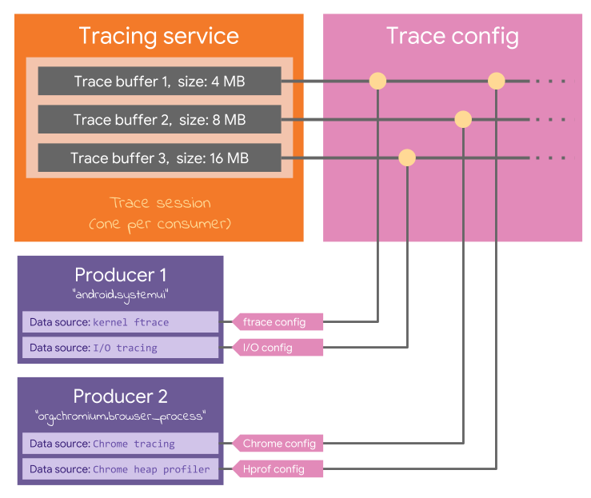

# Perfetto trace config

The [`TraceConfig`](/protos/perfetto/config/trace_config.proto) is an extensible
protobuf message, sent by the consumer to the service, that defines:
- The number and size of the trace buffer.
- The duration of the trace.
- [optionally] a file descriptor for the output trace and a periodic write
  interval. If omitted the trace is kept only in memory.  
- The producers involved in the trace session.
- The data sources involved in the trace session.
- The configuration of each data source.
- The crossbar mapping between each data source and the trace buffers.

Each data source can create its own specialized schema for the config, like
[this](/protos/perfetto/config/ftrace/ftrace_config.proto)

See [`trace_config.proto`](/protos/perfetto/config/trace_config.proto) for more
details.

For convenience, a vulcanized trace config where all the nested protobuf
sub-message definitions are squashed together is available in
[`perfetto_config.proto`](/protos/perfetto/config/perfetto_config.proto).
